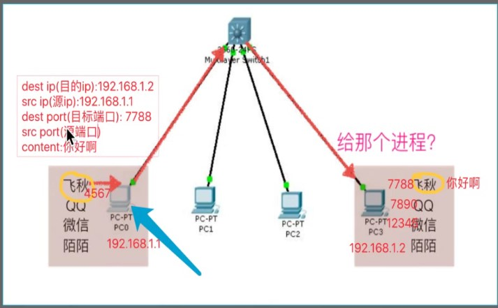

##1、端口



###1.1 知名端口(<1024)，不能随意用

```text
80端口：分配HTTP服务
21端口：分配给FTP服务
```

###1.2 动态端口(1024-65535)

##2、socket
```python
import socket
#创建tcp的套接字，socket.AF_INET：ipv4，SOCK_STREAM：udp
s = socket.socket(socket.AF_INET,socket.SOCK_STREAM)
s.close()#关闭套接字
```