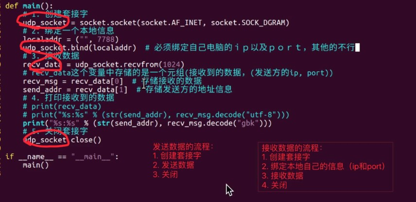

###1.1接收udp数据


###1.2
```python
import socket
#1、创建套接字
udp_socket = socket.socket(socket.AF_INET,socket.SOCK_DGRAM)
localaddr = ("",7890)
udp_socket.bind(localaddr)
#2使用套接字收发数据
udp_socket.sendto("".decode("utf-8"),("192.168.8.19",7890))
udp_socket.recvfrom(1024)
#3、关闭套接字
udp_socket.close()
```

###1.3单工、半双工、全双工
```text
单工：单方向
半双工：
全双工：socket套接字属于全双工
```
