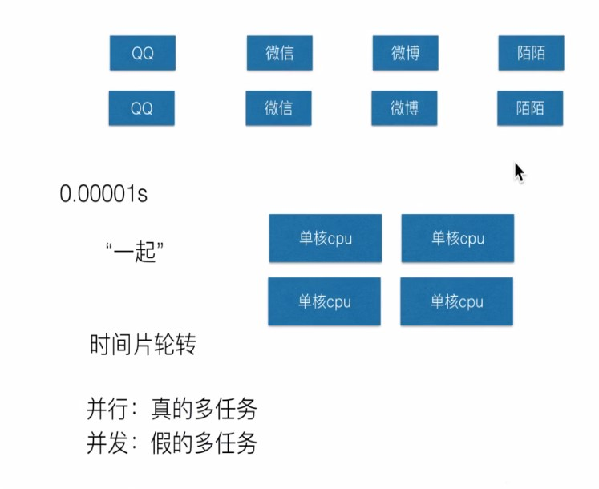
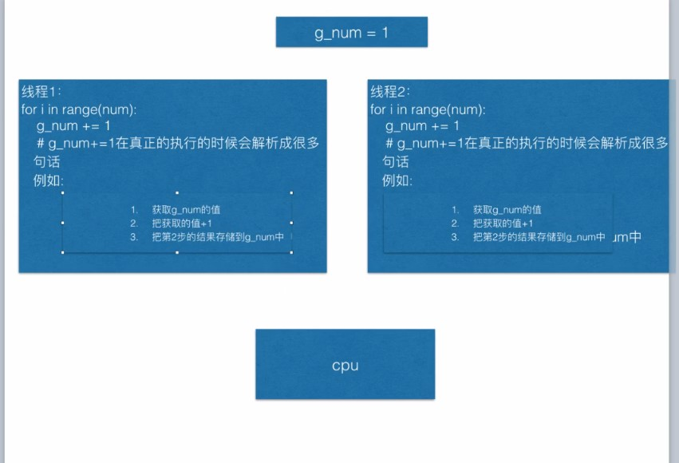

##一
###1.1 多任务


！[](img/线程.jpg )

```text
当调用Thread的时候，不会创建线程

但调用Thread创建出来的实例对象的start方法时才会创建线程以及让这个线程开始运行

```

###1.2创建线程的两种方式

```text
1、Thread(target=函数名)
2、创建类，继承Thread，实现run方法
```

###1.3 多线程共享全局变量
```text
在一个函数中，对全局变量进行修改的时候，到底是否需要使用global进行说明，要看是否对全局变量的执行指向进行了修改
若修改了执行，即全局变量指向了一个新的地方，则必须使用global
若只是修改了指向空间中的数据，此时不用必须使用global
``` 

###1.4、资源竞争


```text
原子性：要不不做，要么全做 
```

###1.5 同步、互斥锁 

```text
死锁：多个进程在竞争资源时造成堵塞现象

上锁：上锁的代码越少越好

避免死锁：
程序设计时要尽量避免（银行家算法）
添加超时时间
```

```python
import threading

#1.创建锁
mutex = threading.Lock()

#2.锁定
mutex.acquire()

#3.释放
mutex.release()
```

###1.6.银行家算法

