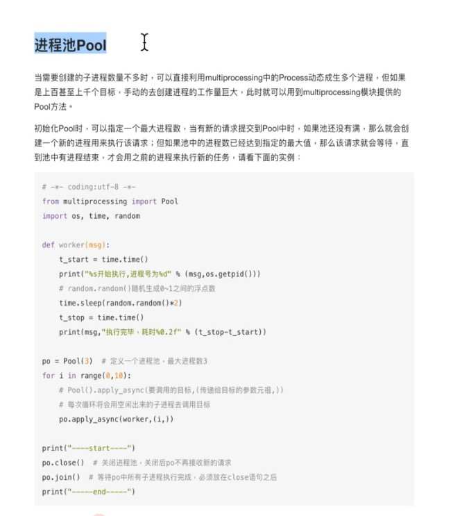

###1.1 进程
```text
程序：是一个静态的
进程：程序的一次执行过程，程序+PCB+数据，是操作系统分配资源和调度的基本单位
进程：代码+资源
线程：程序执行的最小单位
``` 

###1.2进程和线程的区别
```text
进程：能够完成多任务，比如，一台电脑上同时运行多个QQ
线程：能够完成多任务，比如，一个QQ中的多个聊天框
```

###1.3 进程之前的通信（队列Queue）

```text
队列：先进先出，
```

###1.4 进程池（Pool）
